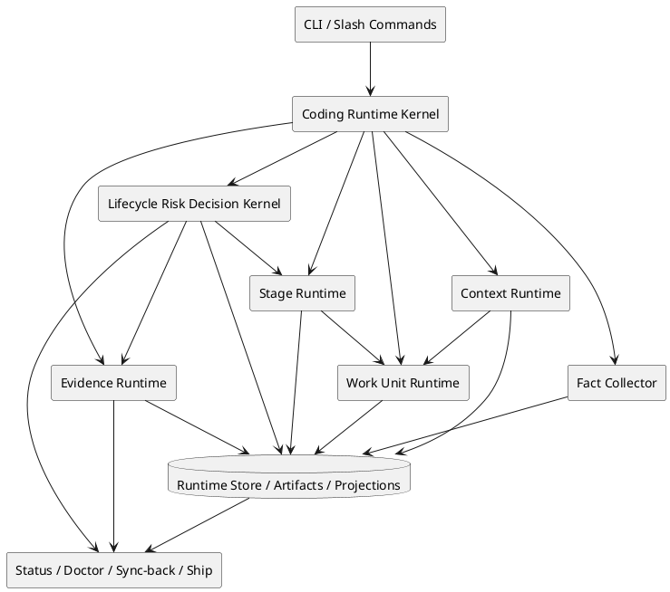
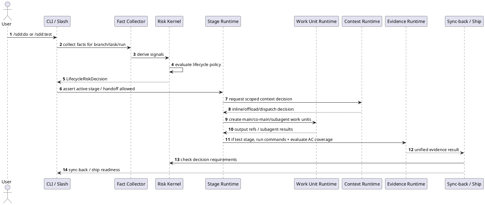
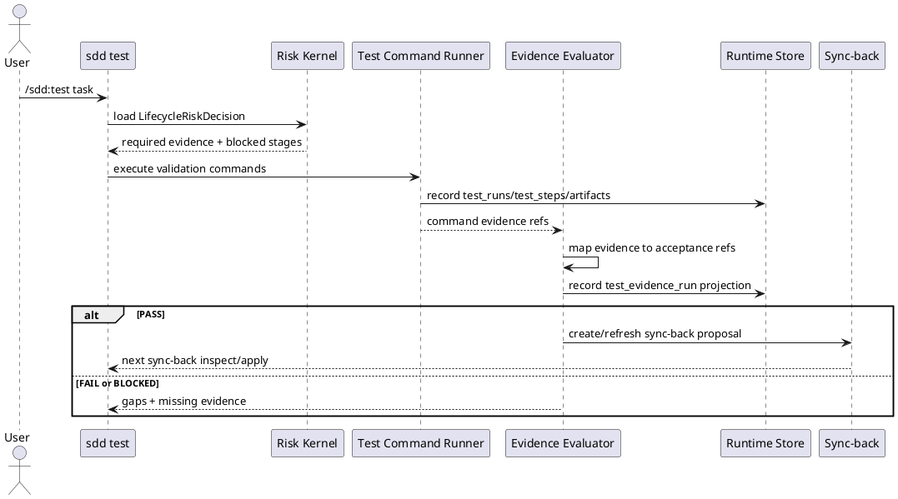
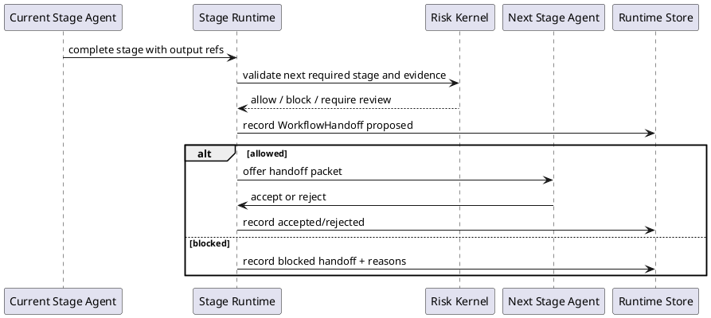

# Phase 8 Plan — Coding Runtime Convergence

## Plan metadata

- based_on_spec: `specs/master/phase8-spec.md`
- based_on_spec_hash: `f1b3fcc16e9884cc1b550aa4ebd87c49d1e508f66137b4bb1162b2dcb229f52c`
- generated_by: `/sdd:plan` workflow instructions (`sdd instructions plan --json`)
- partition_status_observed: `specs/master` active, existing `verify.md` stale for current master workflow
- plan_status: task-ready at workstream level; detailed implementation tasks should be generated by `/sdd:tasks`

## 1. Background

Phase 7 completed a substantial SDD runtime foundation: SDD documents, run-state JSON, Runtime Store v2, workflow state resolution, context packages, command-team runtime profiles, `/sdd:test`, verify/goal verification, sync-back, ship, status, and doctor.

The current code architecture analysis shows that the platform is not a pure prompt workflow anymore, but it is also not yet a coherent coding runtime. Several capabilities exist with names and partial contracts, but their semantics are not aligned:

```text
lifecycle decision exists, but coding risk policy is not unified;
task risk exists, but mixes coding risk, team recommendation, approval, context, and token;
command-team runtime exists, but is static profile/projection rather than real work execution;
context package exists, but optimization is still budget/trimming oriented;
/sdd:test exists, but still points PASS to sdd verify task;
workflow state exists, but it recommends commands instead of managing stage handoff.
```

Phase 8 is therefore a full convergence phase. Its purpose is to align these existing pieces around one runtime control model for better coding quality and efficiency.

## 2. Goals

Phase 8 establishes **Coding Runtime Convergence**:

```text
Coding facts
  -> Lifecycle risk decision
  -> Stage execution and handoff
  -> Work units and subagent dispatch
  -> Context offload
  -> Unified test evidence
  -> Sync-back and ship gates
```

The main goals are:

1. Make coding risk decision independent from agent/team/subagent design.
2. Make lifecycle depth and gates explicit before deciding execution strategy.
3. Introduce stage ownership and workflow handoff for main lifecycle progression.
4. Introduce work units for main-agent, co-main-agent, and subagent execution records.
5. Adopt Claude-style subagent dispatch for isolated, parallel, non-authoritative side work.
6. Reframe context/token optimization as context load and offload.
7. Make `/sdd:test` the unified command execution plus AC evidence judgment stage.
8. Defer code graph implementation to Phase 9 while keeping Phase 8 extension points optional and non-blocking.
9. Keep the user-facing `/sdd:` lifecycle simple and clean.
10. Keep workflow progression controllable while allowing automation inside each approved lifecycle stage.

## 3. Non-goals

Phase 8 will not:

- Expand `CommandTeamRuntime` into the primary execution runtime.
- Let subagents edit production code.
- Let subagents own lifecycle control.
- Default subagents to independent worktrees.
- Build a broad agent marketplace.
- Implement code graph signal providers; this is deferred to Phase 9 after Phase 8 consumers stabilize.
- Keep `TokenHealth` or `ContextBudget` as the primary context optimization vocabulary.
- Keep standalone `/sdd:verify` as a primary slash lifecycle command.
- Replace contracts, runtime state, and evidence with prompt-only orchestration.
- Publish, push, tag, deploy, or mutate remote/shared release state.

## 4. Current state

### 4.1 Existing strengths

Current code already provides useful foundations:

- `LifecycleDecisionRecord` in `packages/core/src/lifecycle/decision-gate.ts` models direct/compact/full/research lifecycle profiles.
- `TaskRiskProfile` in `packages/core/src/task-risk-profile.ts` classifies task risk by tags and affected file classes.
- `CommandTeamRuntimeDecision` in `packages/core/src/registries/command-team-runtime.ts` records command-scoped role/material decisions.
- `ContextBuildPackage` in `packages/core/src/context/build-package.ts` provides role/mode scoped non-authoritative context guidance.
- Runtime Store v2 in `packages/core/src/storage/runtime-store.ts` stores runs, events, artifacts, evidence, projections, test runs, and test steps.
- `WorkflowStateResolution` in `packages/core/src/workflow-state/resolve.ts` aggregates documents, run-state, gaps, conflicts, and next command.
- `SddTestResult` in `packages/core/src/verification/test-runtime.ts` executes validation commands and records command evidence.
- `ShipResult` in `packages/core/src/lifecycle/ship.ts` aggregates status and doctor checks for local readiness.

### 4.2 Current gaps

The current gaps are architectural, not just missing fields:

- Risk decisions are spread across lifecycle gate, task risk, status, sync-back, ship, router, and command team.
- `TaskRiskProfile` mixes lifecycle/coding risk with team and approval recommendations.
- `CommandTeamRuntime` is static metadata and projection, not a real execution runtime.
- Context optimization is still centered on budget, token estimate, trimming, and pressure.
- `/sdd:test` executes commands but still delegates AC judgment to `sdd verify task` as next step.
- Workflow state is inferred from docs/run-state and recommends commands; it does not manage active stage ownership or handoff.
- Runtime Store does not yet have first-class stage handoff, work unit, subagent dispatch, context offload, or unified evidence evaluation concepts.

## 5. Target design

The target design introduces a **Coding Runtime Kernel** with six internal services:



Layer responsibilities:

| Layer | Responsibility |
|---|---|
| Fact Collector | Collect raw facts from SDD docs, run-state, runtime store, changed files, evidence, tests, doctor/status, and external/project state. |
| Lifecycle Risk Decision Kernel | Convert facts into risk profile and lifecycle gate decisions. |
| Stage Runtime | Track active stage ownership and stage-to-stage handoff. |
| Work Unit Runtime | Track main-agent, co-main-agent, and subagent work units. |
| Context Runtime | Decide inline context, summarization, subagent offload, or curation block. |
| Evidence Runtime | Execute validation commands and evaluate AC evidence coverage. |
| Consumers | Status, doctor, sync-back, and ship consume normalized decisions instead of reinterpreting risk independently. |

## 6. Architecture and component impact

### 6.1 Core modules

New or refactored core areas:

```text
packages/core/src/coding-facts/
packages/core/src/risk/
packages/core/src/stage-runtime/
packages/core/src/work-units/
packages/core/src/subagents/
packages/core/src/context-offload/
packages/core/src/evidence-runtime/
```

Existing modules to adapt:

| Existing module | Planned role |
|---|---|
| `lifecycle/decision-gate.ts` | Provide compatibility and migrate lifecycle profile logic into risk decision kernel. |
| `task-risk-profile.ts` | Become an adapter from existing task data to `CodingRiskSignal[]`. |
| `registries/command-team-runtime.ts` | Remain compatibility metadata; no longer primary execution runtime. |
| `context/build-package.ts` | Feed scoped context handoff and context accounting; budget becomes guardrail. |
| `workflow-state/resolve.ts` | Include active stage, latest handoff, and risk-derived next command. |
| `verification/test-runtime.ts` | Become command execution part of unified test evidence runtime. |
| `verification/goal-verify.ts` | Become evidence evaluation part of unified test evidence runtime. |
| `sync-back/*` | Consume lifecycle risk decision and unified evidence result. |
| `lifecycle/ship.ts` | Consume lifecycle risk decision and evidence evaluation instead of token health as primary gate. |
| `doctor/*` | Report missing/stale/inconsistent risk, handoff, work unit, context, and evidence projections. |
| `status/*` | Surface current decision, stage, handoff, context load, and evidence readiness. |

### 6.2 CLI and slash commands

User-facing lifecycle should remain:

```text
/sdd:spec
/sdd:plan
/sdd:tasks
/sdd:do
/sdd:test
/sdd:sync-back
/sdd:ship
status / doctor / statusline
```

`/sdd:test` owns the user-facing verifies preflight: it may inspect, create, or refresh `verify.md` via low-level `sdd verifies` before command execution and acceptance judgment.

Low-level `sdd verifies` and `sdd verify task` may remain as compatibility/diagnostic tools, but they must not be projected as primary slash lifecycle entries or recommended after `/sdd:test` PASS.
`/sdd:doctor` may remain as a diagnostic slash entry. `sdd update` and `sdd instructions <action>` remain CLI/core maintenance and dynamic-instruction capabilities, not default user-facing slash lifecycle entries.

## 7. Interaction and sequence design

### 7.1 Standard high-level workflow



### 7.2 `/sdd:test` unified flow



### 7.3 Stage handoff flow



## 8. State and data design

### 8.1 Core state objects

```ts
interface CodingFactSet {
  contract: 'sdd-coding-fact-set-v1';
  scope: {
    branch: string;
    taskId?: string;
    runId?: string;
    changeRef?: string;
  };
  request: {
    intentKnown: boolean;
    acceptanceKnown: boolean;
    validationKnown: boolean;
  };
  documents: {
    specExists: boolean;
    planExists: boolean;
    tasksExists: boolean;
    verifiesExists: boolean;
  };
  files: CodingFileFact[];
  tests: CodingTestFact[];
  runtime: CodingRuntimeFact[];
  evidence: CodingEvidenceFact[];
  external: CodingExternalFact[];
  generatedAt: string;
}
```

```ts
interface LifecycleRiskDecision {
  contract: 'sdd-lifecycle-risk-decision-v1';
  scope: {
    branch: string;
    taskId?: string;
    runId?: string;
  };
  profile: 'direct' | 'compact' | 'full' | 'research' | 'blocked';
  requiredStages: SddStage[];
  skippedStages: SddStage[];
  blockedStages: SddStage[];
  requiredEvidence: RequiredEvidence[];
  requiredReviews: RequiredReview[];
  humanCheckpointRequired: boolean;
  approvalPolicy: 'auto-allow' | 'review-required' | 'human-required' | 'blocked';
  reasons: string[];
}
```

```ts
interface WorkflowHandoff {
  contract: 'sdd-workflow-handoff-v1';
  id: string;
  runId: string;
  branch: string;
  fromStage: SddStage;
  toStage: SddStage;
  fromAgent: string;
  toAgent: string;
  status: 'proposed' | 'accepted' | 'rejected' | 'blocked';
  outputRefs: string[];
  requiredInputRefs: string[];
  riskDecisionRef: string;
  evidenceRefs: string[];
  openQuestions: string[];
  blockingGaps: string[];
  createdAt: string;
  decidedAt?: string;
}
```

```ts
interface WorkUnit {
  contract: 'sdd-work-unit-v1';
  id: string;
  runId: string;
  stageRunId: string;
  type: 'main-agent' | 'co-main-agent' | 'subagent';
  name: string;
  purpose: string;
  status: 'pending' | 'running' | 'completed' | 'blocked' | 'failed' | 'cancelled';
  blocking: boolean;
  authority: 'stage-owner' | 'stage-contributor' | 'non-authoritative';
  requiredBefore: 'stage-output' | 'handoff' | 'sync-back' | 'ship' | 'never';
  contextRef: string;
  outputRefs: string[];
  evidenceRefs: string[];
  createdAt: string;
  completedAt?: string;
}
```

### 8.2 Storage strategy

Short term: use `projections` to stabilize contracts without immediate schema churn.

```text
coding_fact_set
coding_risk_profile
lifecycle_risk_decision
stage_run
workflow_handoff
work_unit
subagent_dispatch
subagent_result
context_load_signal
context_offload_decision
scoped_context_handoff
test_evidence_run
```

Stable schema candidates after contract validation:

```text
risk_decisions
stage_runs
workflow_handoffs
work_units
subagent_dispatches
subagent_results
context_handoffs
evidence_evaluations
```

## 9. API and schema design

### 9.1 Public core subpaths

Phase 8 should preserve package boundary discipline. New public subpaths should be domain-level, not per-file internals:

```text
@sdd-agent-platform/core/coding-facts
@sdd-agent-platform/core/risk
@sdd-agent-platform/core/stage-runtime
@sdd-agent-platform/core/work-units
@sdd-agent-platform/core/subagents
@sdd-agent-platform/core/context-offload
@sdd-agent-platform/core/evidence-runtime
```

No root `@sdd-agent-platform/core` barrel should be restored.

### 9.2 CLI command behavior

Primary user-facing commands should remain simple:

```text
sdd status
sdd tasks inspect/route/list
sdd do task
sdd verifies inspect/write
sdd test task
sdd sync-back inspect/apply
sdd ship
sdd doctor
```

New low-level diagnostic commands may be added only when they do not pollute the main lifecycle. Examples:

```text
sdd risk inspect
sdd stage inspect
sdd handoff inspect
sdd work-unit inspect
sdd context offload inspect
```

## 10. Concurrency, consistency, and transaction design

A workflow partition can have multiple historical stage runs, but only one current active stage should be authoritative for a task/run scope.

Consistency rules:

- A handoff cannot be accepted if the source stage is not completed.
- A handoff cannot be accepted if lifecycle risk decision blocks the target stage.
- A target stage cannot become active while a required blocking work unit is still running or failed.
- A subagent result cannot mark a stage completed by itself.
- Non-blocking background work can complete after stage progression, but it must not retroactively change passed gates unless a later gate consumes it explicitly.
- `/sdd:test` PASS requires command success plus required acceptance coverage.
- Sync-back and ship should consume the unified evidence result rather than re-evaluating command logs independently.

## 11. Key decisions

### Decision 1 — Risk kernel before agent runtime

Risk decision will be implemented before stage handoff and subagent dispatch become authoritative. This prevents agent/team choices from becoming risk policy.

### Decision 2 — WorkUnit replaces CommandTeamRuntime as execution model

`CommandTeamRuntime` remains compatibility metadata, but new execution records use `WorkUnit`, `SubagentDispatch`, and `SubagentResult`.

### Decision 3 — Subagents are non-authoritative by default

Subagents can inspect, review, diagnose, write tests when allowed, and return artifact-backed results. They cannot own lifecycle gates or modify production code.

### Decision 4 — Context offload replaces token budget as primary model

Budget and token estimates remain useful, but they become diagnostics/guardrails. The primary decision is whether context should stay inline, be summarized, be delegated, or be blocked for curation.

### Decision 5 — `/sdd:test` owns evidence judgment

The user-facing test stage includes evidence judgment. Internal verify compatibility can remain, but it is no longer the primary next step.

## 12. Alternatives considered

### Alternative A — Continue extending CommandTeamRuntime

Rejected as primary direction. It would add more roles, material packs, and token-aware decisions without solving real dispatch, isolated context, background execution, or result integration.

### Alternative B — Build code graph inside Phase 8

Deferred to Phase 9. Code graph is valuable after Phase 8 risk, context, evidence, and workflow consumers stabilize; otherwise it would add infrastructure before the control plane is ready.

### Alternative C — Build subagent runtime first

Deferred. Subagent runtime is important, but without risk decision boundaries it would likely mix policy, lifecycle control, and execution again.

### Alternative D — Keep `/sdd:test` and `sdd verify task` separate

Rejected for user-facing lifecycle. Internal separation can remain as implementation detail, but the main lifecycle should not require users to understand a separate verify stage after test.

## 13. Risk control

| Risk | Control |
|---|---|
| Risk model becomes agent-aware again | Contract tests reject agent/subagent/team fields in lifecycle risk decision. |
| Subagent starts modifying production code | Path policy and permission mode restrict test-writer to test paths; production write attempts block. |
| Runtime Store schema churn becomes too large | Start with projections, migrate stable models later. |
| `/sdd:test` becomes too broad | Keep command execution and evidence evaluation as separate internal modules under one result contract. |
| Context offload becomes another naming layer over budget | Require offload decisions to produce summarize/subagent/curation outcomes, not just trimmed refs. |
| Stage handoff blocks existing workflows unexpectedly | Introduce as observable/projection first, then gate commands once stable. |
| Code graph slips back into Phase 8 | Keep graph implementation out of Phase 8 tasks; only optional future extension points are allowed. |

## 14. Rollout and rollback

### 14.1 Rollout order

```text
Batch 1:
- Contracts and projections
- Lifecycle risk decision kernel
- /sdd:test unified evidence result

Batch 2:
- Stage runtime and handoff projections
- Workflow state/status/doctor integration

Batch 3:
- WorkUnit and subagent contracts
- Context load/offload runtime

Batch 4:
- Final integration, documentation, regression hardening, and Phase 9 code graph handoff
```

### 14.2 Backward compatibility

- Existing task risk and lifecycle decision structures remain readable.
- Existing verify command remains diagnostic/compatibility.
- Existing context package remains non-authoritative and can feed scoped context handoff.
- Existing status/doctor/ship output can include both legacy and new fields during transition.

### 14.3 Rollback

Because early implementation uses projections, rollback can disable new consumers while leaving existing commands intact:

```text
risk decision projection disabled -> fallback to existing lifecycle/task risk behavior
stage handoff disabled -> fallback to workflow-state recommendedNextCommand
unified evidence disabled -> fallback to existing test + verify compatibility path
context offload disabled -> fallback to context build package guidance
```

Rollback must not delete runtime artifacts or evidence.

## 15. Validation matrix

| Area | Validation |
|---|---|
| Build/package | `npm run build`, `npm run typecheck`, `npm pack --dry-run --json` |
| Full regression | `npm test` |
| Risk decision | focused tests for direct/compact/full/research/blocked decisions |
| Risk separation | test that lifecycle risk decision has no agent/team/subagent fields |
| `/sdd:test` | command execution + AC evidence evaluation + sync-back readiness tests |
| Stage handoff | proposed/accepted/rejected/blocked handoff tests |
| Work units | main/co-main/subagent authority and blocking behavior tests |
| Subagent policy | production write blocked, test path write allowed for test-writer |
| Context offload | normal/elevated/high/overloaded decisions and dispatch recommendations |
| Phase 9 handoff | Code graph implementation is documented as deferred and no Phase 8 gate depends on graph signals. |
| Status/doctor | missing/stale/inconsistent decision and handoff diagnostics |
| Ship/sync-back | required evidence and stale evidence gate behavior |
| Smoke | `npm run sdd -- status --branch master`, `npm run sdd -- tasks list --branch master`, `npm run sdd -- doctor --latest-only --branch master` |

## 16. Task breakdown rationale

Tasks should be generated in dependency order, not by file area alone:

1. Contract foundations first, because all later work consumes shared shapes.
2. Risk kernel second, because it controls lifecycle depth and gate requirements.
3. Unified test evidence can run in parallel with early risk integration because the user-facing command boundary is already decided.
4. Stage handoff comes after risk, because handoff must validate against lifecycle decision.
5. Work unit and subagent runtime come after stage handoff, because subagents are stage-internal work and must not own lifecycle control.
6. Context offload follows work units, because high context load should dispatch or summarize through work units/subagents.
7. Code graph is deferred to Phase 9 because it should consume stabilized Phase 8 risk/context/test-impact extension points rather than define them prematurely.
8. Status/doctor/ship integration should be layered after each core model has stable projections.

Recommended future `/sdd:tasks` workstreams:

```text
1. Add Phase 8 contract types and projection helpers.
2. Implement coding fact collection and TaskRiskProfile adapter.
3. Implement lifecycle risk decision kernel and policy tests.
4. Integrate lifecycle risk decision into status/doctor/sync-back/ship read paths.
5. Refactor /sdd:test into unified command execution + evidence evaluation result.
6. Add stage run and workflow handoff projections and diagnostics.
7. Add work unit, subagent definition/dispatch/result contracts and policy enforcement.
8. Add context load/offload decisions and scoped context handoff.
9. Prepare Phase 9 code graph handoff without implementing graph providers in Phase 8.
10. Update docs, generated AI entries, and regression smokes.
```

## 17. Plan gaps and task readiness

### 17.1 Open plan gaps

These do not block task generation at the workstream level, but should be resolved before implementing the relevant workstream:

- Exact persistence boundary: which models remain projection-only in Phase 8 and which graduate to schema tables.
- Exact compatibility lifetime for `sdd verify task`.
- Exact test path policy for `test-writer` subagents.
- Exact Phase 9 code graph scope and first-language baseline.
- Exact CLI diagnostic command names for risk/stage/handoff/work-unit inspection.

### 17.2 Task readiness

The plan is ready for `/sdd:tasks` at the workstream level. Task generation should preserve the dependency order above and should not start implementation before tasks explicitly encode:

- contract boundaries,
- acceptance coverage,
- validation commands,
- migration/compatibility behavior,
- and focused regression tests.

## 18. Architecture hardening supplements

These requirements harden Phase 8 for reliability, extensibility, performance, storage evolution, and clear runtime/model responsibility. They should be treated as implementation constraints for the relevant workstreams, not as a separate feature track.

### 18.1 Projection envelope, idempotency, and staleness

All Phase 8 projections should use one common envelope so status, doctor, sync-back, and ship can reason about freshness consistently:

```ts
interface RuntimeProjectionEnvelope<T> {
  contract: 'sdd-runtime-projection-envelope-v1';
  projectionType: string;
  scopeKey: string;
  id: string;
  inputHash: string;
  producer: string;
  producerVersion: string;
  generatedAt: string;
  staleReason?: string;
  payload: T;
}
```

Projection identity should be deterministic for repeatable runs:

```text
identity = projectionType + scopeKey + inputHash + producerVersion
latest pointer = projectionType + scopeKey
stale if currentInputHash differs from inputHash or producerVersion is incompatible
```

Re-running the same command with the same inputs should update or reuse the same latest projection without duplicating authoritative state. Historical projections may be retained as run artifacts, but consumers should read the latest non-stale projection for a scope unless explicitly inspecting history.

### 18.2 Concurrency, locking, and recovery

Phase 8 must preserve local workflow reliability when commands overlap or background work completes late:

- Reads may be branch-scoped, but writes that change runtime state should be task/run scoped.
- State-changing commands should use optimistic version checks or a task/run write lock.
- A late non-blocking subagent result may append evidence or diagnostics, but must not retroactively change a passed gate unless a later gate explicitly consumes it.
- Failed work units should be retryable through a new work unit attempt rather than mutating the old result in place.
- Rejected handoffs should preserve the source stage output refs and record the rejection reason.
- Blocked stages should record unblock requirements as refs or gaps, not only free-text messages.

### 18.3 Lifecycle risk rule matrix

The lifecycle risk kernel should be a deterministic rule engine. Rule priority is:

```text
blocked > human-required > full > compact > direct
higher evidence requirement wins
lower confidence escalates; it must not de-escalate lifecycle depth
```

Baseline rules:

| Signal | Decision effect |
|---|---|
| Missing required SDD document or unknown acceptance target | `blocked` or `research` until scope is known. |
| Docs-only, acceptance known, validation low impact | `direct` or `compact`. |
| Runtime state, sync-back, ship, or generated AI entry boundary | at least `full` evidence requirements. |
| Production source boundary with public API or dependency fanout | `full` plus review requirement. |
| Security-sensitive, destructive, external/shared-state, or unknown external impact | `human-required` or `blocked` depending on reversibility. |
| Unknown impact data on source changes | escalate to `research` or require additional evidence. |

The risk decision must include input refs, signal refs, policy version, input hash, reasons, and confidence so consumers can diagnose stale or incompatible decisions.

### 18.4 State-machine transition tables

Stage runtime, workflow handoff, work units, and subagent dispatch should each define legal transitions before enforcement:

```text
stage_run: pending -> active -> completed | blocked | skipped | failed
workflow_handoff: proposed -> accepted | rejected | blocked
work_unit: pending -> running -> completed | blocked | failed | cancelled
subagent_dispatch: queued -> running -> completed | failed | cancelled | stale
```

Illegal transitions should be rejected with structured contract issues. Completion of a subagent work unit must not complete a lifecycle stage unless the stage owner consumes the result and records a stage-owned output.

### 18.5 Unified evidence coverage algorithm

`/sdd:test` should separate command execution from evidence judgment while returning one user-facing result:

```text
commandStatus = PASS | FAIL | BLOCKED
evidenceCoverage = complete | partial | missing | stale
policyJudgment = PASS | FAIL | BLOCKED
```

PASS requires successful required commands and complete non-stale evidence coverage for the relevant acceptance refs. FAIL reports failed commands or contradicted evidence. BLOCKED reports missing commands, missing acceptance mapping, stale evidence, or policy requirements that cannot be judged from available evidence.

### 18.6 Context offload scoring

Context load should be computed from explicit signals rather than token count alone:

```text
loadScore = fileCountScore + artifactSizeScore + dependencyFanoutScore + unknownImpactScore + staleEvidenceScore + logVolumeScore
```

Recommended thresholds:

| Level | Runtime action |
|---|---|
| `normal` | Keep scoped context inline. |
| `elevated` | Summarize optional refs and keep must-read refs inline. |
| `high` | Produce scoped context handoff and recommend subagent/offload for bounded side analysis. |
| `overloaded` | Block for curation or require summarization before continuing. |

Subagent dispatch should only be recommended when expected offload benefit is higher than orchestration overhead.

### 18.7 Phase 9 code graph handoff

Code graph implementation is deferred out of Phase 8. Phase 8 should keep optional extension points where risk, context, and evidence runtimes may later consume graph signals, but those extension points must be absent-safe: missing graph data cannot block Phase 8 gates.

The Phase 9 handoff should preserve the intended baseline: changed refs, exported/public API refs, reverse import fanout, impacted tests, confidence, reasons, and cache invalidation based on source hashes, tsconfig/package metadata, lockfile hash, and changed refs.

### 18.8 Storage evolution and retention

Projection-first remains the Phase 8 default. A model should graduate to stable Runtime Store tables only when it needs field-level queries, transition history, concurrent updates, or cross-consumer joins.

Likely graduation order:

```text
stage_runs / workflow_handoffs / work_units -> early candidates
test_evidence_run -> candidate once AC coverage queries stabilize
context_offload_decision -> projection-first until cache shape stabilizes
```

Large logs, raw model outputs, and large context dumps should be stored as artifacts; projections should store compact summaries, hashes, and refs. Doctor should report oversized, stale, or incompatible projections.

### 18.9 LLM boundary contract

Runtime policy and gate decisions must remain deterministic platform responsibilities. Model-produced outputs are useful as summaries, diagnostics, test suggestions, or evidence candidates, but they are not final lifecycle authority by default.

```ts
interface ModelProducedArtifact {
  producer: 'main-agent' | 'co-main-agent' | 'subagent';
  authority: 'stage-owned' | 'candidate' | 'non-authoritative';
  allowedUse: Array<'summary' | 'diagnostic' | 'test-suggestion' | 'evidence-candidate'>;
  forbiddenUse: Array<'final-risk-decision' | 'stage-completion' | 'ship-gate-pass'>;
  artifactRefs: string[];
  reviewedByRuntime: boolean;
}
```

The runtime may consume model-produced artifacts only through explicit refs and policy checks. Subagent results stay non-authoritative unless a future evidence policy explicitly upgrades a specific result type after runtime validation.