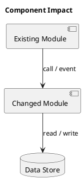
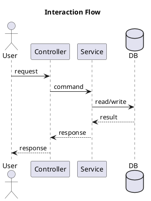
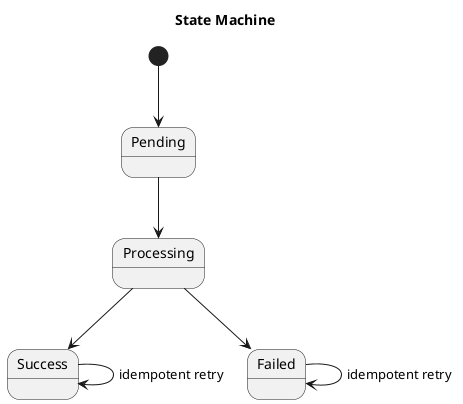

# Plan: <feature-or-change-name>

Template prose may be localized by project `docs_language`; contract identifiers, metadata keys, IDs, commands, status values, and fenced block names remain stable/English.

## 0. Metadata

- spec_id: `<spec-id>`
- plan_id: `<plan-id>`
- branch: `<branch>`
- lifecycle_profile: `compact | full | research`
- risk_level: `low | medium | high`
- owner: `<owner>`
- reviewers: []
- related_tasks: []
- created_at: `<ISO-8601>`
- updated_at: `<ISO-8601>`

## 0.1 Requirement Trace

| Spec Item | Plan Section | Design Response |
|---|---|---|
| AC-1 | §4 Target Design Overview | `<how this design answers the acceptance criterion>` |

## 1. Background / Context

Explain why this change exists, what business or engineering problem it solves, and which constraints shape the solution.

## 2. Goals and Non-goals

### Goals

- Goal 1.

### Non-goals

- Explicitly out-of-scope item.

## 3. Current State Analysis

Describe the existing behavior, flow, code ownership, data/state/API behavior, and known failure modes.

## 4. Target Design Overview

Describe the selected technical solution and how it moves from the approved spec to task-ready implementation.

## 5. Architecture / Component Design

Use PlantUML when component impact is non-trivial.

## 6. Interaction / Sequence Design

Add a PlantUML sequence or activity diagram for cross-component flows, async behavior, retries, or concurrency.

## 7. State / Data Design

Describe state machines, data model changes, persistence rules, idempotency, migration, and rollback impact.

## 8. Interface / API / Schema Design

Describe API, DTO, event, contract, schema, and compatibility impact. Write `None` only after checking.

## 9. Concurrency / Transaction / Consistency Design

Describe transaction boundaries, locks, optimistic checks, idempotency, retries, and consistency guarantees when relevant.

## 10. Key Design Decisions

| Decision | Reason | Tradeoff | Rejected alternatives |
|---|---|---|---|
| `<decision>` | `<reason>` | `<tradeoff>` | `<alternatives>` |

## 11. Alternatives Considered

| Alternative | Why rejected |
|---|---|
| `<alternative>` | `<reason>` |

## 12. Risk Control

| Risk | Impact | Control |
|---|---|---|
| `<risk>` | `<impact>` | `<mitigation>` |

## 13. Compatibility / Rollout / Rollback

Describe compatibility, rollout order, manual gates, release strategy, and rollback path.

## 14. Validation Plan

| Area / Acceptance | Validation Method | Command / Evidence |
|---|---|---|
| AC-1 | Manual/automated check | `<command or artifact>` |

## 15. Task Breakdown Rationale

Explain why tasks should be split this way, what each boundary protects, and which validations belong to each task.

## 16. Open Questions

- Question or decision that must be resolved before tasks or implementation.

## 17. Risk-driven Plan Requirements

- `state-machine` risk: include State / Data Design and a PlantUML state diagram.
- `concurrency` risk: include sequence/activity diagram plus Concurrency / Transaction / Consistency Design.
- `database` risk: include data, transaction, migration, and rollback design.
- `api_schema` risk: include Interface / API / Schema Design and compatibility notes.
- `security` or `sql` risk: include explicit risk controls.
- `ci_build` risk: include build/test/release validation evidence.

## Phase Gate Checkpoint

- ready_for_tasks: `true | false`
- blockers: []
- required_user_decisions: []
